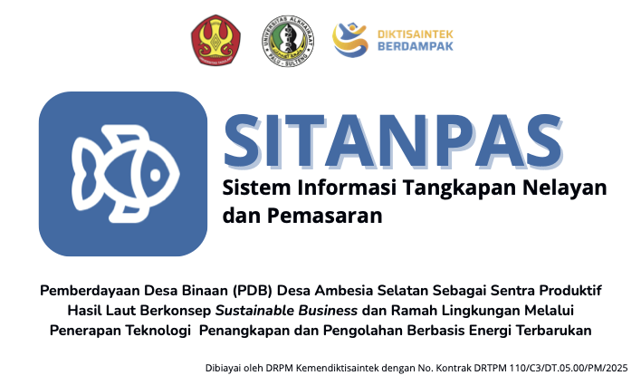

# 🐟 SITANPAS v2 — Sistem Informasi Tangkapan Nelayan dan Pemasaran



[](#-tentang-sitanpas-v2)
[](#-konteks-akademik--program)
[](https://doi.org/10.13140/RG.2.2.17822.91204)
[](#-lisensi)

---

## 📌 Tentang SITANPAS v2

**SITANPAS v2** (Sistem Informasi Tangkapan Nelayan dan Pemasaran Versi 2) adalah platform *digital marketplace* dan manajemen perikanan tangkap berbasis web yang dirancang untuk memodernisasi ekosistem perdagangan hasil laut di kawasan pesisir Desa Ambesia Selatan, Kabupaten Parigi Moutong, Sulawesi Tengah.

Versi 2.0 ini merupakan **pengembangan dan penyempurnaan sistem secara menyeluruh** yang mencakup:

1. **Peningkatan Performa & Arsitektur Database:** Refactoring total skema basis data PostgreSQL (Supabase) dengan mengintegrasikan aturan *Row Level Security* (RLS) terpadu, fungsi otomatisasi (*triggers*), dan *Database Views* untuk analitik real-time.
2. **Optimalisasi Alur Pengguna (User Flow):** Penataan ulang hak akses multi-peran (*Admin*, *Nelayan*, dan *Customer Guest*) serta penyempurnaan alur pemesanan langsung tanpa wajib registrasi (*Guest Checkout*).
3. **Penyempurnaan Antarmuka (UI/UX):** Pembaruan komponen antarmuka yang lebih responsif, bersih, dan siap untuk tahap komersialisasi publik.

---

## 🎓 Konteks Akademik & Program

Platform ini dikembangkan dan diimplementasikan sebagai bagian dari **Luaran Utama Program Tri Dharma Perguruan Tinggi**:

* **Program Pemberdayaan Desa Binaan (PDB) Tahun Anggaran 2025**  
  Dibiayai oleh **Direktorat Riset, Teknologi, dan Pengabdian kepada Masyarakat (DRPM), Kementerian Pendidikan Tinggi, Sains, dan Teknologi (Kemendiktisaintek) RI** (No. Kontrak: `110/C3/DT.05.00/PM/2025`).
* **Konsorsium Perguruan Tinggi Kolaboratif**  
  Kolaborasi resmi antara **Universitas Tadulako** (Host) dan **Universitas Alkhairaat** Palu.
* **Kuliah Kerja Nyata Tematik (KKN-T) Angkatan 3**  
  Diintegrasikan langsung dengan pengabdian mahasiswa di lapangan dalam melakukan pendampingan teknis, digitalisasi nelayan, dan pembinaan UMKM pesisir.
* **Pengembangan Tugas Akhir (TA)**  
  Dikembangkan oleh **Lukman Hakim** (Mahasiswa S1 Teknik Informatika, Universitas Tadulako) sebagai dasar infrastruktur sistem informasi dalam penulisan Tugas Akhir.

---

## 🏆 Capaian & Luaran Program (Impact)

1. **Hak Kekayaan Intelektual (HKI / Hak Cipta):**  
   Terdaftar resmi di DJKI Kemenkumham RI sebagai Program Komputer dengan Nomor Pencatatan **`EC002025130723`**.
2. **Infrastruktur IoT & Digitalisasi Bagan:**  
   Pemasangan unit mikrokontroler Raspberry Pi 5, sensor timbangan digital (*Load Cell*), modem router 4G outdoor, dan display monitor informasi di darat.
3. **Formalisasi & Legalitas UMKM Mitra:**  
   Fasilitasi penerbitan 6 Nomor Induk Berusaha (NIB), pendampingan Sertifikasi Halal, serta pendaftaran merek dagang *"Ikan Asin Barakuda Ambesia Selatan Fish"* di PDKI DJKI.

---

## 🔑 Fitur Utama Sistem

* **Public Customer (Guest Checkout):** Transaksi pembelian ikan segar/kering secara cepat tanpa proses registrasi yang rumit.
* **Fisherman Dashboard:** Pengelolaan produk ikan, pemantauan pesanan masuk, dan input hasil tangkapan.
* **Admin Verification & Approval System:** Panel kontrol Admin untuk memverifikasi akun nelayan baru (*Pending/Approve/Reject*) dan memantau analitik pendapatan harian/bulanan.
* **Stok Automasi & Transaksi:** Pengurangan stok produk secara otomatis saat terjadi transaksi dan pengembalian stok saat pembatalan.

---

## 🔗 Artefak Riset Terbuka (Open-Science Datasets)

Sebagai bentuk komitmen pada *open-science*, data empiris dan *benchmark* penelitian yang dihasilkan dari arsitektur SITANPAS v2 ini tersedia secara publik di Kaggle untuk keperluan pemodelan *Artificial Intelligence* (AI) dan *Natural Language Processing* (NLP):

1. **[South Ambesia Coastal Fishery & Marine Products](https://www.kaggle.com/datasets/nara0102/south-ambesia-coastal-fishery-and-marine-products):** Dataset katalog produk, harga historis, dan matriks *ground-truth* pengujian Information Retrieval (IR).
2. **[SITANPAS: Coastal Fishery IoT Smart Scale Telemetry](https://www.kaggle.com/datasets/nara0102/sitanpas-iot-smart-scale-telemetry):** Dataset riwayat telemetri (713 rekaman) dari purwarupa IoT timbangan beban (*strain-gauge load cell* / ESP32).

---

## 📚 Publikasi Akademik & Sitasi

Jika Anda menggunakan *source code*, arsitektur sistem, atau dataset dari proyek ini untuk keperluan riset akademis, mohon sitasi *Working Paper* teknis kami:

**Text Citation (IEEE):**
> L. Hakim and Y. A. Rahman, "SITANPAS v2: Evolution of a Digital Fish-Catch Information and Marketing Platform for South Ambesia, Central Sulawesi, Indonesia," Technical Working Paper, Faculty of Engineering, Tadulako University, Palu, Indonesia, 2026. DOI: 10.13140/RG.2.2.17822.91204

**BibTeX:**
```bibtex
@techreport{hakim2026sitanpasv2,
  author      = {Hakim, Lukman and Rahman, Yuli Asmi},
  title       = {{SITANPAS v2: Evolution of a Digital Fish-Catch Information and Marketing Platform for South Ambesia, Central Sulawesi, Indonesia}},
  institution = {Faculty of Engineering, Tadulako University},
  year        = {2026},
  type        = {Technical Working Paper},
  address     = {Palu, Indonesia},
  doi         = {10.13140/RG.2.2.17822.91204},
  url         = {[https://www.researchgate.net/publication/414034353_SITANPAS_v2_Evolution_of_a_Digital_Fish-Catch_Information_and_Marketing_Platform_for_South_Ambesia_Central_Sulawesi_Indonesia](https://www.researchgate.net/publication/414034353_SITANPAS_v2_Evolution_of_a_Digital_Fish-Catch_Information_and_Marketing_Platform_for_South_Ambesia_Central_Sulawesi_Indonesia)}
}
```

## 📄 Dokumentasi Arsitektur & Panduan Terpisah

Untuk menjaga kebersihan dokumentasi utama, rincian teknis, struktur folder, skema database, hingga panduan instalasi telah dipisahkan ke dalam direktori [`/md`](./md/):

* 📄 **[PRD.md](./md/PRD.md):** *Product Requirement Document* (Detail kebutuhan bisnis, alur pengguna, dan target pengguna).
* 🏗️ **[ARCHITECTURE.md](./md/ARCHITECTURE.md):** *Tech Stack, Environment Variables, & Presisi Struktur Folder Proyek*.
* 🗄️ **[SCHEMA.md](./md/SCHEMA.md):** *Struktur Tabel Supabase, Foreign Keys, Trigger Automasi, & Kebijakan RLS*.
* 🚀 **[Deployment Guide](./md/DEPLOYMENT.md):** *Panduan Siklus Deployment Otomatis via GitHub & Netlify*.
* 📋 **[System & Environment Requirements](./md/REQUIREMENTS.md):** *Spesifikasi Minimum Perangkat Lunak, Layanan Cloud BaaS, dan Hardware IoT ESP32*.

---

## 📄 Lisensi

Proyek ini dilindungi di bawah **[MIT License](./LICENSE)**.  
*SITANPAS v2 © 2026 oleh Lukman Hakim — Program Studi Teknik Informatika, Fakultas Teknik, Universitas Tadulako.*
